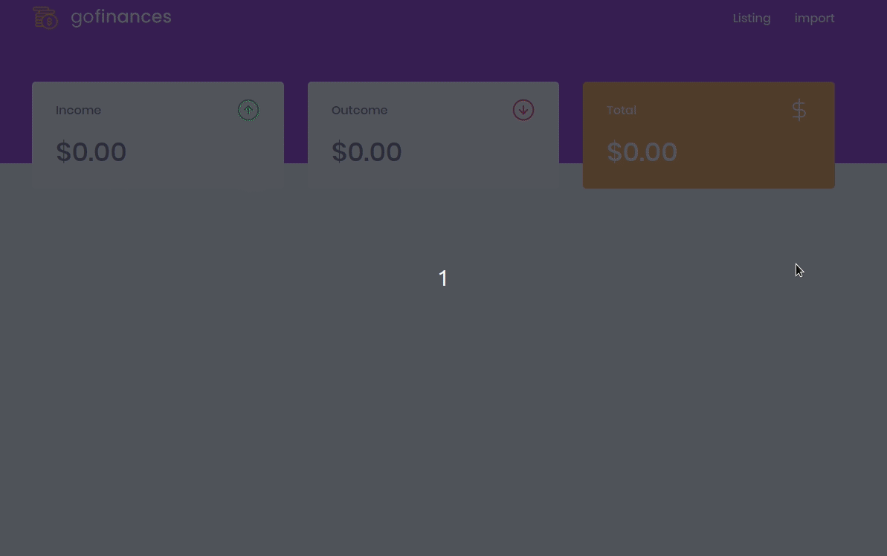

<p align="center">
  <a href="" rel="noopener">
    
  </a>
</p>

<h3 align="center">GoFinances</h3>

<div align="center">

[]()
[](https://github.com/beatrizmf/gofinances/issues)
[](https://github.com/beatrizf13/gofinances/pulls)
[](/LICENSE)

</div>

---

<p align="center"> Control in your financial life. 💰
    <br> 
</p>

## 📝 Table of Contents

- [Demo / Working](#demo)
- [Getting Started](#getting_started)
- [Running the tests](#tests)
- [Built Using](#built_using)
- [Authors](#authors)

## 🎥 Demo / Working <a name = "demo"></a>



You can also see the prototype on <a  rel="noopener" target="_blank" href="https://www.figma.com/file/lUzRjrTcDpjCztiPY6cTcr/GoFinances">Figma</a>.

## 🏁 Getting Started <a name = "getting_started"></a>

These instructions will get you a copy of the project up and running on your local machine for development and testing purposes.

### Prerequisites

What things you need to install the software and how to install them.

```
node -v
```

### Installing and starting

A step by step series of examples that tell you how to get a development env running.

```
cd web
yarn
yarn start
```

```
cd backend
yarn
yarn dev:server
```

Remember change settings to database in backend/ormconfig.json

## 🔧 Running the tests <a name = "tests"></a>

```
cd web
yarn
yarn test
```

```
cd backend
yarn
yarn test
```

## ⛏️ Built Using <a name = "built_using"></a>

- [TypeScript](https://www.typescriptlang.org/) - Typed JavaScript
- [NodeJs](https://nodejs.org/) - Server Environment
- [Express](https://expressjs.com/) - Server Framework
- [TypeORM](http://typeorm.io/) - ORM
- [React](https://reactjs.org/) - Web Framework

## ✍️ Authors <a name = "authors"></a>

- [@beatrizmv](https://github.com/beatrizmf) 
